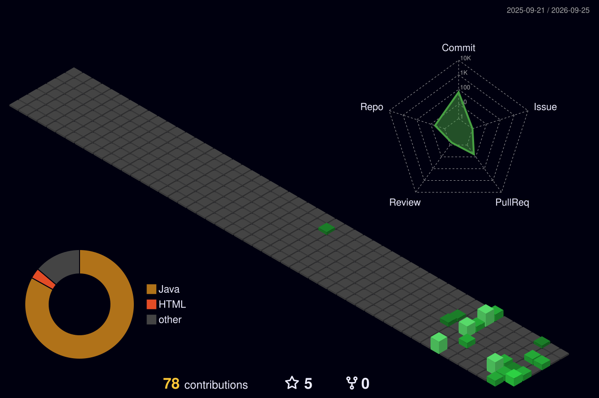

# 💫 About Me:
Hi there, I'm Rupesh Attarde 👋  🎓  BCA student passionate about Artificial Intelligence, Machine Learning, and Backend Development. I enjoy building practical applications using Python, APIs, and modern AI technologies. My interests include Generative AI, Large Language Models (LLMs), Retrieval-Augmented Generation (RAG), and developing scalable backend systems.  📫 Connect With Me Feel free to explore my repositories, contribute to my projects, or connect with me for collaboration.

# 💻 Tech Stack:
               
# 📊 GitHub Stats:
 
 

# 📈 Contribution Graph

## 🏆 GitHub Trophies

### ✍️ Random Dev Quote

### 🔝 Top Contributed Repo

---

<!-- Proudly created with GPRM ( https://gprm.itsvg.in ) -->
